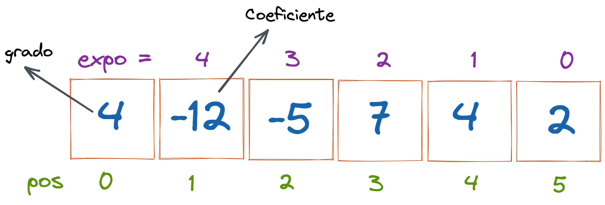
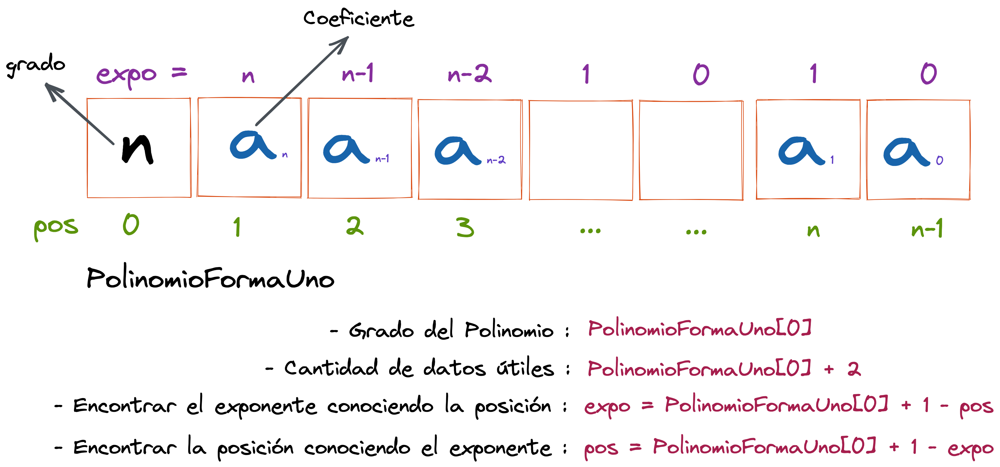

# Polinomios representados como vector forma 1

El primer elemento del vector será **el grado del polinomio** y los siguientes `n+1` elementos serán los coeficientes de los términos del polinomio ordenados en forma **decreciente de acuerdo al exponente.**

Si tenemos el siguiente polinomio de **grado 4**.

La siguiente figura muestra la representación del polinomio en un vector forma 1.

En su forma general, un polinomio representado como vector forma 1 quedaría definido de la siguiente manera:

## Métodos Principales Polinomio Vector Forma 1

1. [Mostrar](https://github.com/JohnFlorez25/estructuras-datos/blob/main/1.%20Polinomios/1.%20Vector%20Forma%201/mostrar.md)
2. [Ajustar]()
3. [Insertar Término]()
4. [Sumar]()
5. [Multiplicar]()
6. [Dividir]()
