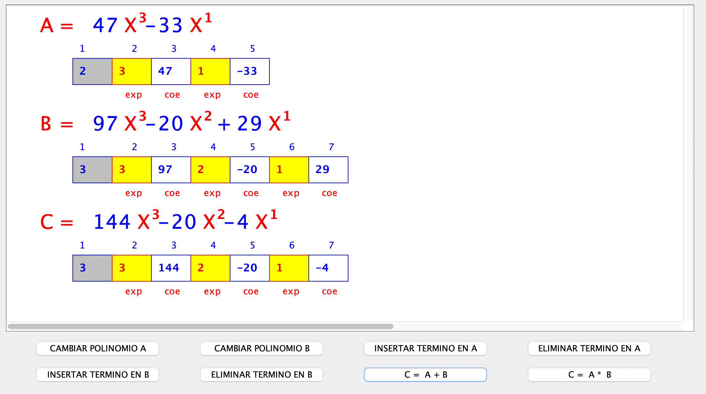

# Polinomio Vector Forma 2 en POO con Interfaz Gráfica

## Acciones a realizar

1. Configure un proyecto en su editor de código de preferencia realizados bajo el lenguaje de programación **Java**.
2. Ejecute la clase principal y visualice el resultado con interfaz gráfica.

3. **Agregue los siguientes métodos:**

>NOTA: Cada opción debe ser un botón en la interfaz gráfica.

- Escoger en que Polinomio desea insertar un término (A,B, C)
- Sumar dos Polinomios
- Multiplicar dos Polinomios
- Eliminar término de un Polinomio

4. **Resultado esperado**

