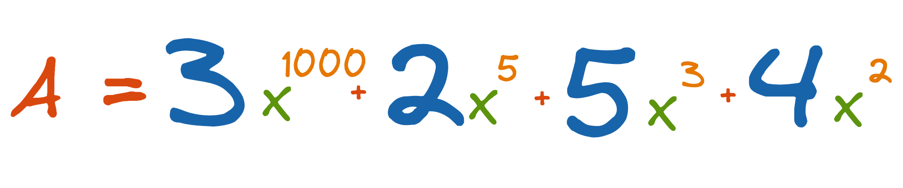
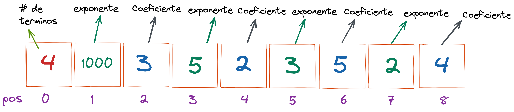
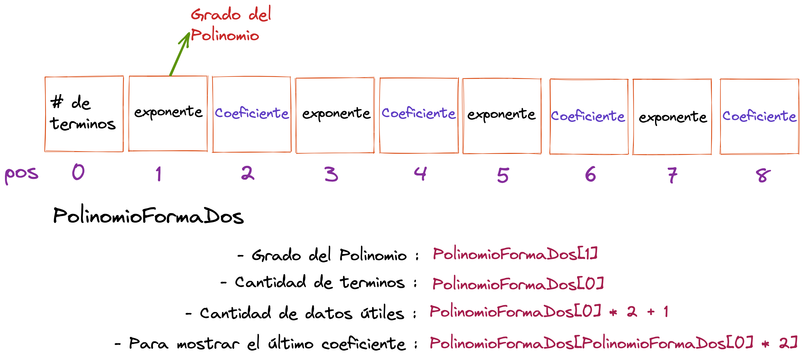

# Polinomios representados como vector forma 2

En la primera posición del vector se almacena **el valor que indica la cantidad de términos diferentes de 0** que tenga el polinomio y luego se almacena en forma **decreciente** de acuerdo al exponente **cada uno de los términos diferentes de 0** que tenga el polinomio, utilizando para cada término 2 posiciones una para el **exponente** y otra para el **coeficiente**.

Si tenemos el siguiente polinomio de **grado 1000**.

La siguiente figura muestra la representación del polinomio en un vector forma 2.

En su forma general, un polinomio representado como vector forma 2 quedaría definido de la siguiente manera:

## Métodos Principales Polinomio Vector Forma 2

1. [Mostrar](https://github.com/JohnFlorez25/estructuras-datos/blob/main/1.%20Polinomios/2.%20Vector%20Forma%202/mostrar.md)
2. [Insertar Término](https://github.com/JohnFlorez25/estructuras-datos/blob/main/1.%20Polinomios/2.%20Vector%20Forma%202/insertarTermino.md)
3. [Sumar](https://github.com/JohnFlorez25/estructuras-datos/blob/main/1.%20Polinomios/2.%20Vector%20Forma%202/sumar.md)
4. [Comparar Polinomios](https://github.com/JohnFlorez25/estructuras-datos/blob/main/1.%20Polinomios/2.%20Vector%20Forma%202/compararPolinomios.md)