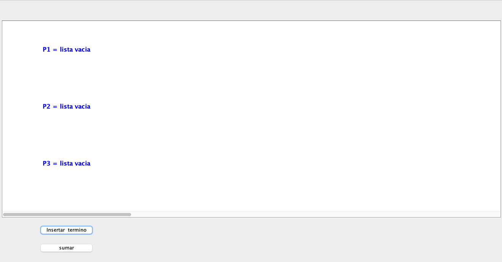

# Polinomio Vector Forma 3 en POO con Interfaz Gráfica

## Acciones a realizar

1. Configure un proyecto en su editor de código de preferencia bajo el lenguaje de programación **Java**.

2. Ejecute la clase principal y visualice el resultado con interfaz gráfica.

3. **Interfaz Gráfica Inicial**

4. **Agregue los siguientes métodos:**

>NOTA: Cada opción debe ser un botón en la interfaz gráfica.

- Escoger en que Polinomio (P1,P2) desea insertar un término 
- Eliminar un término 
- Sumar Polinomio P1 y P2 mostrar resultado en Polinomio P3
- Multiplicar Polinomio P1 y P2 mostrar resultado en Polinomio P3
- Dividir Polinomio P1 y P2 mostrar resultado en Polinomio P3