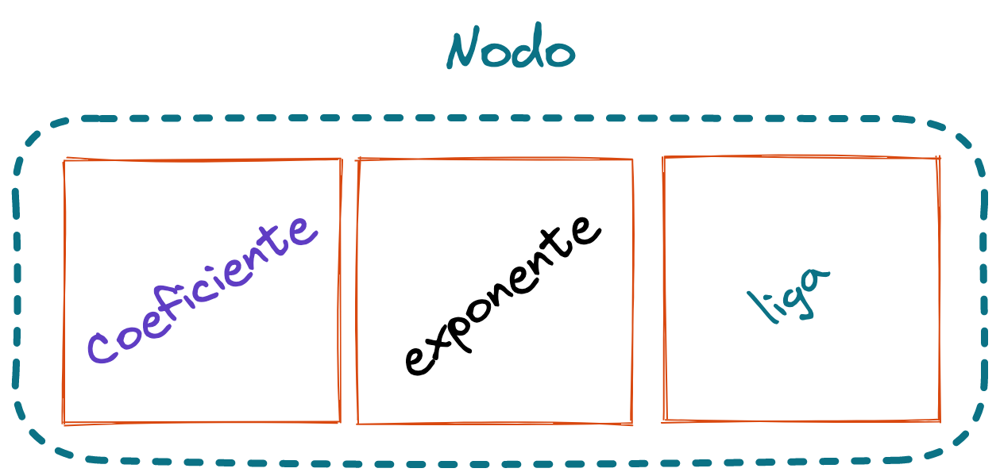
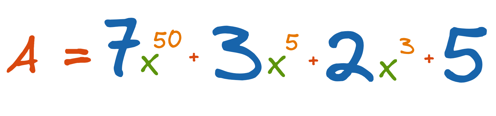
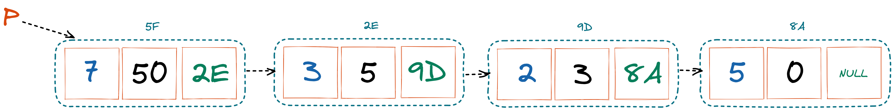
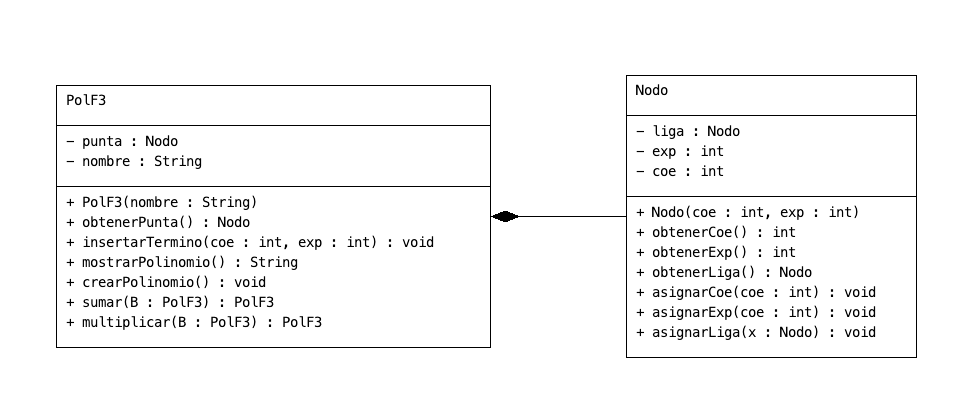

# Polinomios representados como Listas Ligadas

Se utiliza un **nodo** para guardar el **coeficiente** y el **exponente** de cada uno de los términos del Polinomio.

Cada uno de los nodos se van agregando a la **lista** de manera decreciente de acuerdo al termino.

## Configuración del Nodo

Si tenemos el siguiente polinomio de **grado 50**.

La siguiente figura muestra la representación del polinomio en una lista ligada.

## Diagrama de Clases

## Prácticas POO en Java Polinomio Forma 3

1. [Consola](https://github.com/JohnFlorez25/estructuras-datos/tree/main/1.%20Polinomios/3.%20Listas%20Ligadas/PolF3-console)
2. [IGU](https://github.com/JohnFlorez25/estructuras-datos/tree/main/1.%20Polinomios/3.%20Listas%20Ligadas/PolF3-IGU)
