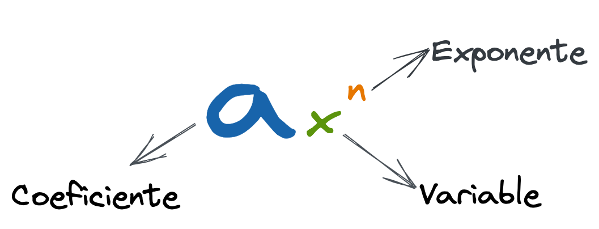
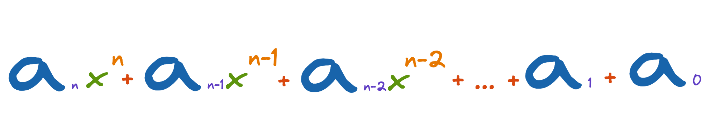
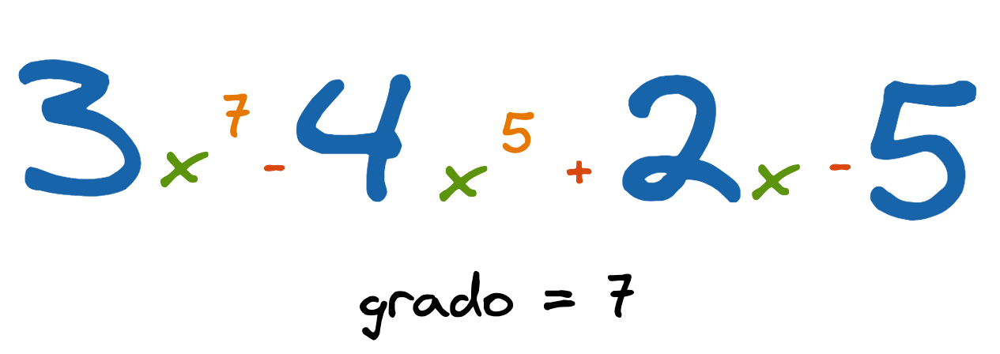

# Polinomios

Un Polinomio es un objeto matemático utilizado en cálculo y análisis matemático para apróximar cualquier función derivable.

Un polinomio es una expresión compuesta por dos o más términos algebraicos unidos con los signos `+` y `-`.

Los polinomios están formados por términos. Cada término tiene coeficiente, base y exponente.

## Forma general de un polinomio

## Ejemplo

**Grado del Polinomio**: Es el mayor exponente encontrado en los términos del polinomio.

Los polinomios que vamos a trabajar tendrán sus términos ordenados por exponente iniciando por el término que tiene el grado del polinomio (mayor exponente). 

Estudiaremos como representar los polinomios en el computador y como realizar las diferentes operaciones con ellos. 

### Representación de polinomios en memoria

1. [En vector Forma 1](https://github.com/JohnFlorez25/estructuras-datos/tree/main/1.%20Polinomios/1.%20Vector%20Forma%201)
2. [En vector Forma 2](https://github.com/JohnFlorez25/estructuras-datos/tree/main/1.%20Polinomios/2.%20Vector%20Forma%202)
3. [En Listas Ligadas]()
