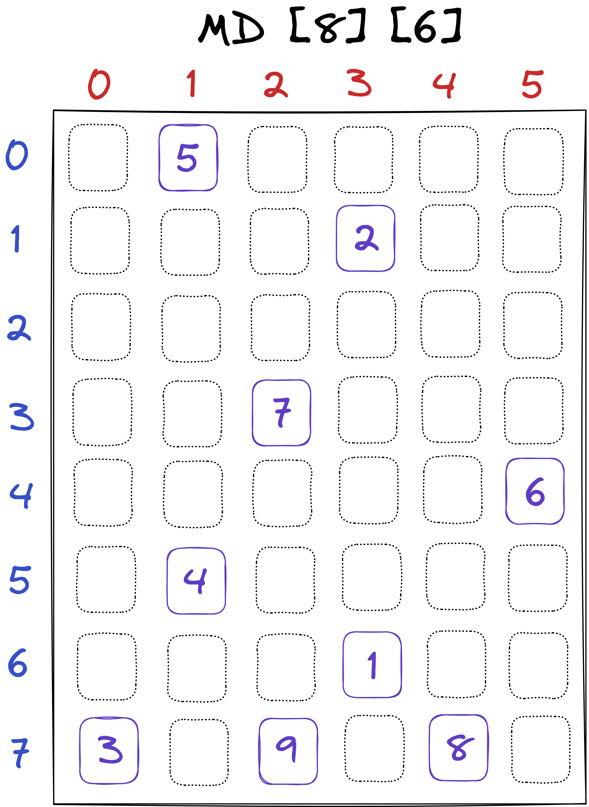
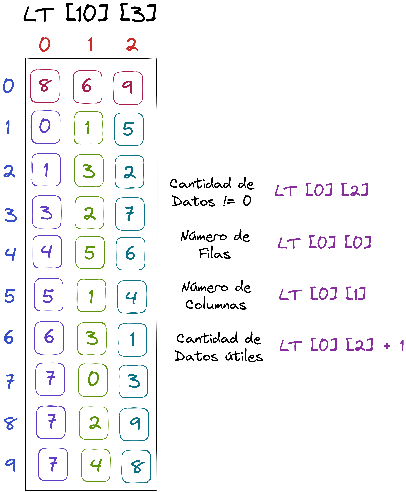

# Matriz Dispersa representada como Lista de Tripletas

Se utiliza una **tripleta** por cada término **diferente de 0** que haya en la matriz dispersa, la tripleta contendrá la siguiente información: **F (fila), C (columna), D(Dato).**

En la **primera tripleta** de la lista se almacena la **información de la matriz dispersa así**:

- **Nfilas** (número de filas)
- **Ncol** (número de columnas)
- **CantDatos** (cantidad de datos diferentes de cero)

A partir de la segunda tripleta se coloca cada uno de los términos diferentes de 0 **ordenados por filas  y dentro de las filas por columnas.**

Si tenemos la siguiente matriz dispersa de 8 Filas y 6 Columnas

Su representación en **Lista de Tripletas** sería:

