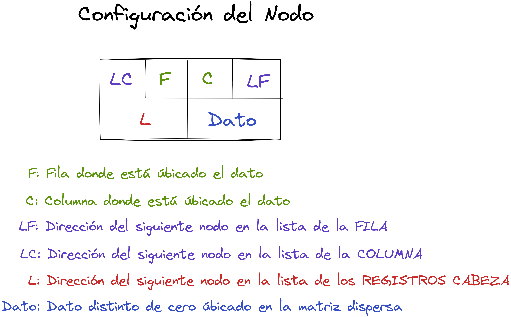
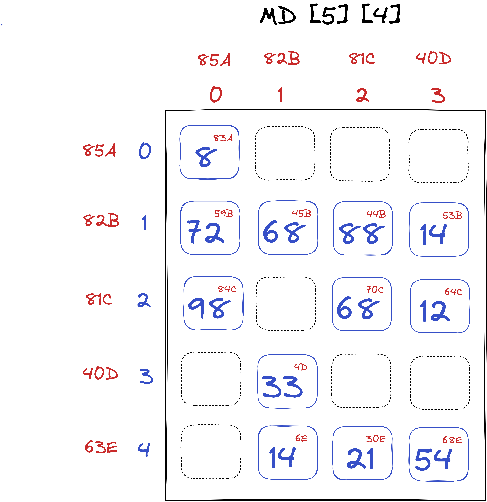

# Matriz Dispersa representada como Lista Ligada Forma 1

**LSLC (Lista Simplemente Ligada Circular)**

1. Se tendrá una **LSLC** con **nodo(registro) cabeza** por cada **fila** de la Matriz Dispersa.
2. Se tendrá una **LSLC** con **nodo(registro) cabeza** por cada **columna** de la Matriz Dispersa.
3. El **nodo cabeza** de la **fila I** será el mismo **nodo cabeza** de la **columna J**.
4. **Todo nodo (registro)** pertenecerá **simultáneamente** a dos listas; a la **lista de las filas** y a la **lista de las columnas**
5. La **cantidad de nodos(registros) cabeza** la determina el **mayor** entre el **número de filas y el número de columnas.**
6. Se creará una **LSLC** con **nodo cabeza** con todos los **nodos(registros) cabeza.**

Partiendo de la siguiente **Matriz Dispersa**

Podemos identificar las siguientes **Listas Ligadas Circulares por Filas y Columnas** con sus respectivos nodos (registros) cabeza.

Obteniendo la siguiente representación:

## Métodos Principales Matrices Dispersas representadas en Listas Ligadas Forma 1

1. [Construir Cabezas]()
2. [Ligar Fila]()
3. [Ligar Columna]()
4. [Insertar Término]()
5. [Mostrar]()
