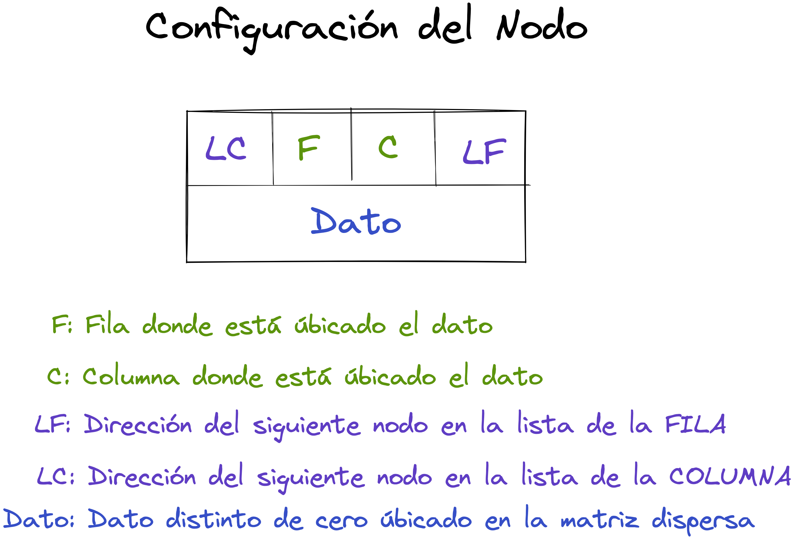

# Matriz Dispersa representada como Lista Ligada Forma 2

**LSLC (Lista Simplemente Ligada Circular)**

1. Se tendrá una **LSLC** con **nodo(registro) cabeza** conformada con los nodos enlazados de manera **ascendente** por **filas**
1. Se tendrá una **LSLC** con **nodo(registro) cabeza** conformada con los nodos enlazados de manera **ascendente** por **columnas**
3. El **nodo cabeza** sera **el mismo** para las dos listas

Partiendo de la siguiente **Matriz Dispersa**

Podemos identificar las siguientes **Listas Ligadas Circulares por Filas y Columnas** con sus respectivo nodo cabeza.

Obteniendo la siguiente representación:

## Métodos Principales Matrices Dispersas representadas en Listas Ligadas Forma 2

1. [Construir Cabezas]()
2. [Ligar Fila]()
3. [Ligar Columna]()
4. [Insertar Término]()
5. [Mostrar]()
